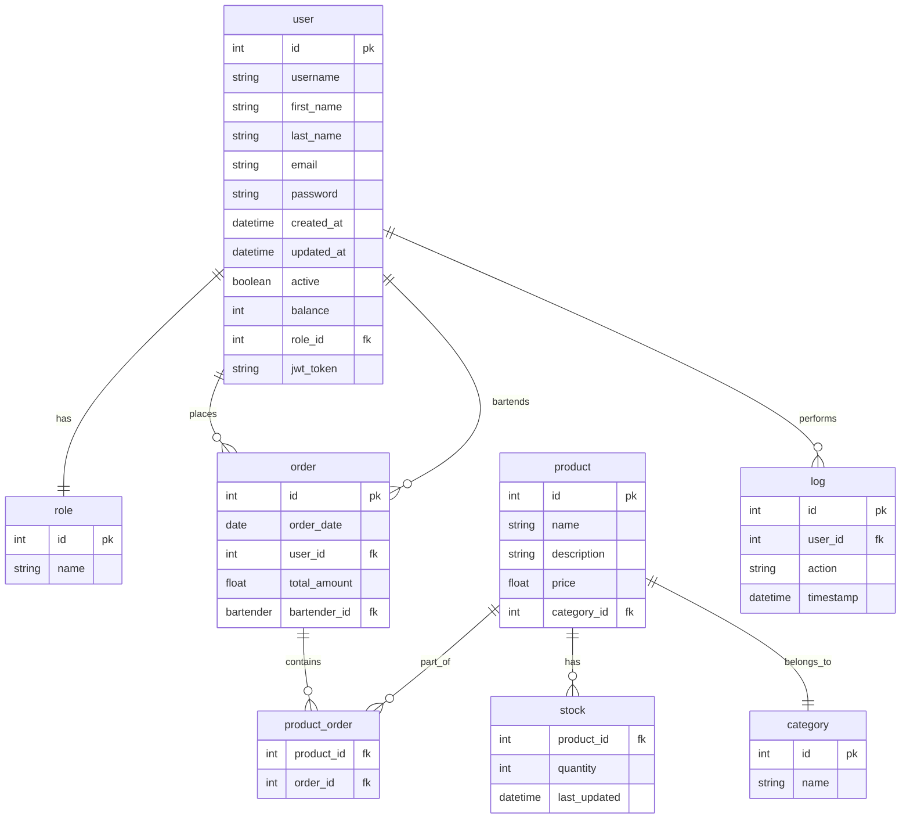

# Entity-Relationship Diagram (ERD)

## Entities

### user

- **user_id** (Primary Key)
- username (Unique, Indexed)
- first_name
- last_name
- email (Unique, Indexed)
- password
- created_at
- updated_at
- active
- balance
- role_id (Foreign Key, Indexed)
- jwt_token

### role

- **role_id** (Primary Key)
- name (Unique, Indexed)

### product

- **product_id** (Primary Key)
- name (Indexed)
- description
- price
- category_id (Foreign Key, Indexed)

### category

- **category_id** (Primary Key)
- name (Unique, Indexed)

### order

- **order_id** (Primary Key)
- order_date
- user_id (Foreign Key, Indexed)
- total_amount
- bartender_id (Foreign Key, Indexed)

### product_order

- **product_id** (Foreign Key, Indexed)
- **order_id** (Foreign Key, Indexed)

### log

- **log_id** (Primary Key)
- user_id (Foreign Key, Indexed)
- action
- timestamp

### stock

- **product_id** (Foreign Key, Indexed)
- quantity
- last_updated

## Relationships

- A **user** can place multiple **orders**.
- An **order** can contain multiple **products**.
- A **product** can be part of multiple **orders**.
- A **user** can perform multiple **logs**.
- A **bartender** is a user who made the **order**.
- A **product** has a **stock** entry.
- A **user** has a **role**.
- A **product** belongs to a **category**.

## Diagram

